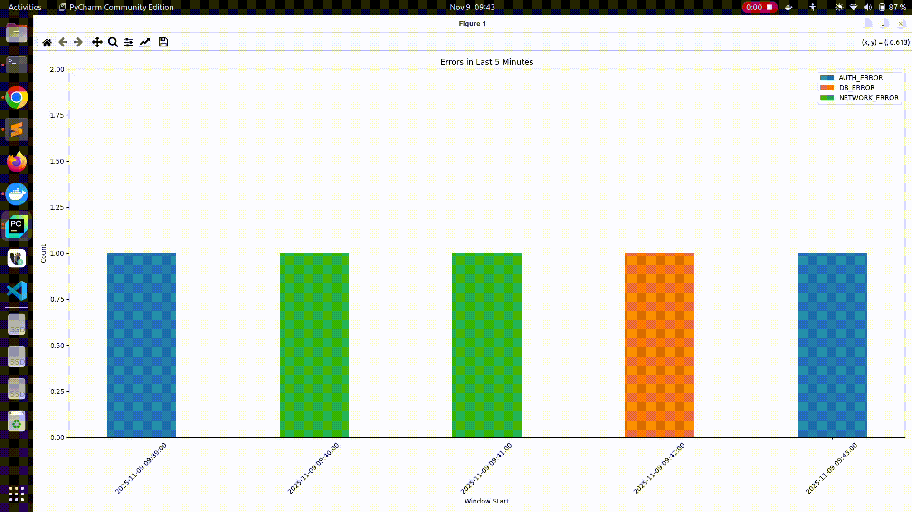

# **error_log_producer.py : Pushes error messages to Kafka topic.**

# **App.java : Reads messages and calculates the top error in last 5 minutes in one minute interval and pushes to a topic.**

# **consumer.py : Reads and loads to sqlite db.**

# **plot.py : Reads sqlite db and create plots.**

[]
